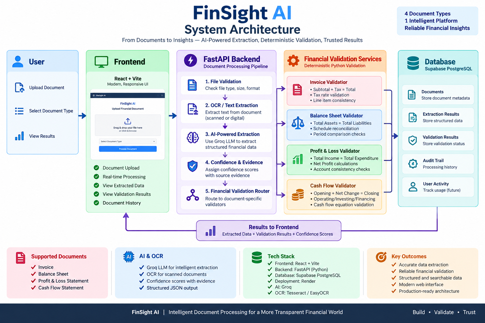

# FinSight AI

<p align="center">

 <strong>Intelligent Financial Document Extraction & Validation</strong><br>

  Upload financial documents, extract structured data with AI, validate financial arithmetic deterministically, persist results, and review them through a web dashboard.

</p>

<p align="center">

  <a href="https://finsight-ai-povk.onrender.com">
    
  </a>

  <a href="https://document-intelligence-538o.onrender.com">
    
  </a>

  <a href="https://document-intelligence-538o.onrender.com/docs">
    
  </a>

  
  
  
  

</p>

## Live Application

<div align="center">

<a href="https://finsight-ai-povk.onrender.com">
  
</a>

<a href="https://document-intelligence-538o.onrender.com">
  
</a>

<a href="https://document-intelligence-538o.onrender.com/docs">
  
</a>

</div>

---

## 1. What is FinSight AI?

****FinSight AI**** is an end-to-end document intelligence system for financial documents.

It is designed around a practical processing pipeline:

```text

Document Upload

      ↓

File Validation

      ↓

Native PDF Text Extraction / OCR

      ↓

AI Field + Table Extraction

      ↓

Evidence + Confidence

      ↓

Document-Type Validation Router

      ↓

Financial Reconciliation Checks

      ↓

Supabase PostgreSQL Persistence

      ↓

Dashboard / REST API / Swagger

```

The system supports four financial document types:

| Document type | AI extraction | Financial validation | Dashboard/API |

|---|:---:|:---:|:---:|

| Invoice | ✅ | ✅ | ✅ |

| Balance Sheet | ✅ | ✅ | ✅ |

| Profit & Loss | ✅ | ✅ | ✅ |

| Cash Flow Statement | ✅ | ✅ | ✅ |

The implementation follows the case-study requirements for upload, validation, OCR/text extraction, AI extraction, structured JSON, financial calculation validation, confidence/evidence, persistence, API access, frontend review, and deployment.

---

## 2. Core Features

### Document intake

- PDF, JPG, JPEG, and PNG support

- File validation before expensive processing

- Filename and document-type validation

- Maximum-page constraints handled by the document validation layer

- Unsupported, empty, unreadable, and invalid documents can be rejected

### OCR and text extraction

- Native PDF text extraction is attempted first

- Scanned PDFs fall back to image-based OCR

- JPG/PNG files are processed through Tesseract OCR

- OCR output preserves page separators for scanned PDFs

### AI extraction

The extraction layer uses Groq with:

```text

Model: openai/gpt-oss-20b

```

The AI produces a flexible, generic structure rather than forcing every document into one rigid schema.

Each extracted field can contain:

```json

{

  "name": "field_name",

  "value": "...",

  "evidence": "Source text supporting the extraction",

  "confidence": 0.92

}

```

Tables are represented as:

```json

{

  "table_name": "Line Items",

  "headers": ["Description", "Quantity", "Amount"],

  "rows": [

    ["Example", 2, 1000]

  ]

}

```

Important extraction behavior:

- Missing values are represented as `null` / unavailable rather than invented

- Evidence can be attached to extracted fields

- Confidence can be displayed per field and as an overall extraction measure

- Table structure remains flexible across different financial documents

- The AI is not trusted as the final arithmetic authority

---

# 1. Financial Validation Engine

A core design decision in FinSight AI is to separate ****AI extraction**** from ****deterministic financial validation****.

The AI extracts the numbers.

Python validation services calculate and reconcile the numbers.

This makes the system easier to inspect, test, and explain.

## Invoice validation

The Invoice validator checks, where the required values are available:

```text

Quantity × Unit Price ≈ Net Amount

Net Amount × VAT % ≈ VAT Amount

Net Amount + VAT ≈ Gross Amount

Σ Line VAT ≈ Invoice VAT

Subtotal + VAT ≈ Invoice Total

```

Tolerance is used for ordinary decimal/rounding differences rather than requiring unrealistic exact equality.

## Balance Sheet validation

For each detected period:

```text

Total Capital & Liabilities ≈ Total Assets

```

Component reconciliation is also attempted where enough complete data is available:

```text

Capital

+ Reserves and Surplus

+ Minority Interest

+ Deposits

+ Borrowings

+ Other Liabilities / Provisions

≈ Total Capital & Liabilities

```

and:

```text

Cash

+ Bank Balances

+ Investments

+ Advances

+ Fixed Assets

+ Other Assets

≈ Total Assets

```

The implementation deliberately returns `NOT_APPLICABLE` for a component check when the extracted structure is insufficient rather than fabricating a result.

## Profit & Loss validation

For each detected reporting period:

```text

Interest Earned + Other Income ≈ Total Income

```

```text

Interest Expended

+ Operating Expenses

+ Provisions / Contingencies

≈ Total Expenditure

```

```text

Total Income - Total Expenditure

≈ Net Profit Before Minority Interest

```

```text

Net Profit Before Minority Interest

- Minority Interest

≈ Consolidated Profit

```

```text

Consolidated Profit

+ Balance Brought Forward

≈ Total Available for Appropriation

```

The validator also treats ambiguous comparative/associate-profit extraction cautiously instead of silently modifying mandatory formulas.

## Cash Flow validation

For each detected reporting period:

```text

Operating Cash Flow

+ Investing Cash Flow

+ Financing Cash Flow

+ FX / Translation Effects

≈ Net Increase in Cash

```

and:

```text

Opening Cash

+ Net Increase

+ Applicable Adjustments

≈ Closing Cash

```

Parenthesized financial figures are handled as negative values where appropriate.

An important principle is preserved:

*> A source-level discrepancy is surfaced as a validation failure; the system does not "correct" the source data just to force a PASS.*

---

# 2. Validation Router

The financial validators are modularized by document type and coordinated through:

```text

backend/app/services/validation_router.py

```

The router selects:

```text

invoice

      → financial_validation_service.py

balance_sheet

      → balance_sheet_validation_service.py

profit_and_loss

      → profit_loss_validation_service.py

cash_flow_statement

      → cash_flow_validation_service.py

```

This keeps document-specific reconciliation logic isolated while giving the API one common entry point:

```python

validate_document_financials(

    extraction=extracted_data,

    document_type=document_type,

)

```

---

# 3. Evidence and Confidence

FinSight AI does not only return extracted values.

The frontend exposes:

- extracted field name

- extracted value

- field-level confidence when available

- source/evidence text when available

- missing/unavailable field highlighting

- low-confidence highlighting

- overall extraction confidence

The UI visually distinguishes missing fields and lower-confidence fields so a reviewer can focus on uncertain outputs instead of treating every AI result equally.

---

# 4. API

Base backend:

```text

https://document-intelligence-538o.onrender.com

```

Swagger:

```text

https://document-intelligence-538o.onrender.com/docs

```

## Health

```http

GET /api/v1/health

```

Example:

```json

{

  "status": "ok",

  "service": "document-intelligence"

}

```

## Process document

```http

POST /api/v1/documents/process

```

Form fields:

```text

file            multipart file

document_type   invoice | balance_sheet | profit_and_loss | cash_flow_statement

```

High-level response structure:

```json

{

  "document_name": "example.pdf",

  "document_type": "balance_sheet",

  "processing_status": "PASS",

  "file_validation": {},

  "extracted_text": "...",

  "extracted_data": {

    "ai_document_type": "balance_sheet",

    "fields": [],

    "tables": []

  },

  "confidence": 0.91,

  "validation": {

    "overall_status": "PASS",

    "checks": [],

    "errors": [],

    "warnings": [],

    "summary": {

      "periods_checked": 2,

      "passed_checks": 4,

      "failed_checks": 0,

      "not_applicable_checks": 2

    }

  }

}

```

## Get one document

```http

GET /api/v1/documents/{document_name}

```

Example:

```text

GET /api/v1/documents/Balance%20Sheet%202019.pdf

```

The endpoint returns the stored processing result.

## List documents

```http

GET /api/v1/documents

```

Example:

```json

{

  "count": 2,

  "documents": [

    {

      "id": 1,

      "document_name": "Balance Sheet 2019.pdf",

      "document_type": "balance_sheet",

      "processing_status": "PASS"

    }

  ]

}

```

---

# 5. Web Dashboard

The frontend is intentionally implemented as a lightweight static application:

```text

frontend/

├── index.html

├── style.css

└── app.js

```

The current frontend includes:

### Dashboard

- processed-document history

- total document count

- passed/failed counts

- average confidence

- document type

- processing status

- last updated timestamp

- quick access to stored results

### Document processing

- document-type selector

- file upload

- processing status

- deployed API health indicator

- success/error messaging

### Result view

- document summary

- processing status

- confidence

- financial validation summary

- detailed validation checks

- calculated vs reported values

- variance

- extracted fields

- field confidence

- source evidence

- missing-field highlighting

- low-confidence highlighting

- structured extracted tables

- raw JSON viewer

- copy-JSON action

### UI / UX

The frontend includes:

- responsive desktop/mobile layout

- light/dark theme

- persisted theme preference

- accessible focus states

- responsive financial tables

- visual PASS / FAIL / WARNING / NOT_APPLICABLE states

- an editorial visual style built around a high-contrast signal color and structured information panels

---

# 6. Data Persistence

FinSight AI uses ****Supabase PostgreSQL**** as the hosted database.

The backend uses:

```text

SQLAlchemy

psycopg2-binary

PostgreSQL

Supabase

```

The document result is persisted after processing.

The logical record contains:

| Column | Purpose |

|---|---|

| `id` | Database primary key |

| `document_name` | Original uploaded filename |

| `document_type` | Requested document type |

| `processing_status` | PASS / FAILED |

| `file_validation_json` | File validation result |

| `extracted_text` | OCR/native text |

| `extracted_data_json` | Structured AI extraction |

| `confidence` | Overall extraction confidence |

| `validation_json` | Financial validation result |

| `created_at` | Creation timestamp |

| `updated_at` | Last update timestamp |

The database layer updates an existing record for the same document name instead of creating unrestricted duplicates.

---

# 7. End-to-End Architecture

[](https://finsight-ai-povk.onrender.com)

**Architecture — Live Frontend:** https://finsight-ai-povk.onrender.com  
**Architecture — Live Backend:** https://document-intelligence-538o.onrender.com  
**Architecture — Swagger:** https://document-intelligence-538o.onrender.com/docs

The architecture separates document intake, extraction, deterministic financial validation, persistence, and presentation into clear layers.

```text

User

  │

  ▼

Render Static Frontend

  │

  │ HTTPS / multipart / JSON

  ▼

Render FastAPI Backend

  │

  ├── File Validation

  │

  ├── Native PDF Text Extraction

  │       └── pypdf

  │

  ├── OCR

  │       ├── Tesseract

  │       └── Poppler / pdf2image

  │

  ├── Groq AI Extraction

  │       └── openai/gpt-oss-20b

  │

  ├── Confidence + Evidence

  │

  └── Financial Validation Router

          ├── Invoice Validator

          ├── Balance Sheet Validator

          ├── Profit & Loss Validator

          └── Cash Flow Validator

                    │

                    ▼

             Supabase PostgreSQL

                    │

                    ▼

          Stored Results / History

                    │

                    ▼

              Frontend Dashboard

```

The key trust boundary is deliberate:

```text

AI

└── extracts and structures financial information

Deterministic Python

└── performs arithmetic reconciliation and validation

PostgreSQL

└── persists the processing result

Frontend

└── presents extraction, confidence, evidence, and validation

```

# 8. Repository Structure

```text

document-intelligence/

│

├── backend/

│   ├── __init__.py

│   │

│   ├── app/

│   │   ├── __init__.py

│   │   ├── main.py

│   │   │

│   │   ├── db/

│   │   │   ├── __init__.py

│   │   │   ├── database.py

│   │   │   └── models.py

│   │   │

│   │   ├── schemas/

│   │   │   ├── balance_sheet.py

│   │   │   ├── cash_flow.py

│   │   │   ├── extraction.py

│   │   │   ├── invoice.py

│   │   │   └── profit_loss.py

│   │   │

│   │   └── services/

│   │       ├── balance_sheet_validation_service.py

│   │       ├── cash_flow_validation_service.py

│   │       ├── document_storage_service.py

│   │       ├── document_validation_service.py

│   │       ├── extraction_service.py

│   │       ├── financial_validation_service.py

│   │       ├── ocr_service.py

│   │       ├── profit_loss_validation_service.py

│   │       └── validation_router.py

│   │

│   ├── tests/

│   │   ├── __init__.py

│   │   ├── test_api.py

│   │   ├── test_document_validation.py

│   │   └── test_financial_validators.py

│   │

│   ├── test_balance_sheet_validation.py

│   ├── test_cash_flow_validation.py

│   ├── test_extraction.py

│   └── test_validation.py

│

├── frontend/

│   ├── index.html

│   ├── style.css

│   └── app.js

│

├── Dockerfile

├── requirements.txt

├── .gitignore

├── .env

└── README.md

```

*> `.env` is local configuration and must not be committed to source control.*

---

# 9. Technology Stack

| Layer | Technology |

|---|---|

| Frontend | HTML5, CSS3, Vanilla JavaScript |

| Backend | FastAPI |

| API server | Uvicorn |

| AI extraction | Groq API |

| AI model | `openai/gpt-oss-20b` |

| OCR | Tesseract |

| PDF rendering for OCR | Poppler + `pdf2image` |

| Native PDF text | `pypdf` |

| Image handling | Pillow |

| Validation | Python deterministic arithmetic |

| Data validation | Pydantic |

| ORM / DB access | SQLAlchemy |

| Database | PostgreSQL |

| Hosted database | Supabase |

| Backend deployment | Render |

| Containerization | Docker |

| API documentation | OpenAPI / Swagger UI |

| Testing | pytest |

---

# 10. Python Dependencies

The current environment includes the main packages required by the application:

```text

fastapi

uvicorn

python-multipart

pypdf

pdf2image

pytesseract

pillow

groq

python-dotenv

SQLAlchemy

psycopg2-binary

pytest

```

The project also retains pinned transitive dependencies in `requirements.txt`.

---

# 11. Local Development

## Prerequisites

Install:

- Python 3.12+ recommended for deployment

- Tesseract OCR

- Poppler

- Docker Desktop (for container testing)

A local Windows development environment can use local Tesseract/Poppler installations. The OCR service also supports hosted Linux environments where these tools are available on the system `PATH`.

## Create virtual environment

```powershell

python -m venv .venv

```

Activate:

```powershell

.\.venv\Scripts\Activate.ps1

```

## Install dependencies

```powershell

pip install -r requirements.txt

```

## Environment variables

Create `.env` in the project root:

```env

GROQ_API_KEY=your_groq_key

DATABASE_URL=postgresql://...

```

For hosted deployment, these values should be configured through the hosting provider's secret/environment-variable settings.

## Run backend locally

```powershell

uvicorn backend.app.main:app --reload

```

Open:

```text

http://127.0.0.1:8000/docs

```

## Run frontend locally

From the project root:

```powershell

python -m http.server 5500 --directory frontend

```

Open:

```text

http://127.0.0.1:5500

```

---

# 12. Docker

The backend is containerized so the deployment environment can install system OCR dependencies consistently.

The Docker image installs:

```text

Tesseract OCR

Poppler

Python dependencies

```

and starts FastAPI with:

```bash

uvicorn backend.app.main:app --host 0.0.0.0 --port $PORT

```

## Build image

```powershell

docker build -t document-intelligence .

```

## Run image with local secrets

```powershell

docker run --rm -p 8000:8000 --env-file .env document-intelligence

```

Then:

```text

http://127.0.0.1:8000/docs

```

---

# 13. Deployment

## Backend

The backend is deployed on ****Render**** as a Docker-based web service.

Live backend:

```text

https://document-intelligence-538o.onrender.com

```

Swagger:

```text

https://document-intelligence-538o.onrender.com/docs

```

Health check:

```text

https://document-intelligence-538o.onrender.com/api/v1/health

```

Render environment variables:

```text

GROQ_API_KEY

DATABASE_URL

```

## Database

The application uses hosted PostgreSQL through ****Supabase****.

The deployed backend connects to the database through the PostgreSQL connection string configured as:

```env

DATABASE_URL=...

```

For hosted IPv4 environments, use the appropriate Supabase pooler connection configuration supplied by the project.

## Frontend

The frontend is a static HTML/CSS/JavaScript application and can be deployed as a Render Static Site.

The frontend API target is configured in:

```text

frontend/app.js

```

Example:

```javascript

const API_BASE_URL =

    "https://document-intelligence-538o.onrender.com";

```

---

# 14. Security Practices

Secrets are externalized from application code.

Do not commit:

```text

.env

.venv/

*.db

__pycache__/

*.pyc

```

The `.gitignore` should contain:

```text

.env

.venv/

__pycache__/

*.pyc

*.db

```

Recommended production improvements include:

- authentication and authorization

- upload rate limiting

- file-content scanning

- stricter CORS configuration

- structured application logging

- audit trails

- encrypted object storage for original files

- retention/deletion policies

- monitoring and alerting

- background job processing for long-running OCR/AI workloads

---

# 15. Error Handling

The API uses structured HTTP errors for important pipeline failures.

Representative codes include:

```text

MISSING_FILENAME

UNSUPPORTED_DOCUMENT_TYPE

FILE_READ_ERROR

FILE_VALIDATION_ERROR

UNSUPPORTED_FILE_TYPE

OCR_ERROR

AI_EXTRACTION_ERROR

CONFIDENCE_CALCULATION_ERROR

FINANCIAL_VALIDATION_ERROR

DATABASE_STORAGE_ERROR

DATABASE_READ_ERROR

DOCUMENT_NOT_FOUND

```

The processing pipeline stops early when a document is invalid or no readable text can be extracted.

---

# 16. Processing Status Rules

The API separates:

```text

processing_status

```

from:

```text

validation.overall_status

```

Financial validation can produce:

```text

PASS

FAIL

WARNING

NOT_APPLICABLE

```

The high-level document processing result uses:

```text

PASS

FAILED

```

For example:

```text

Validation:

FAIL

Processing:

FAILED

```

or:

```text

Validation:

WARNING

Processing:

PASS

```

The intention is to expose validation information while maintaining a simple top-level processing state for dashboard/API consumers.

---

# 17. Failure Behavior

The system is designed not to invent missing financial values.

Examples:

### Missing value

```text

value = null

```

and the UI highlights it as unavailable.

### Insufficient validation data

```text

status = NOT_APPLICABLE

```

rather than manufacturing an operand.

### Source arithmetic discrepancy

```text

status = FAIL

```

with:

```text

calculated

reported

variance

formula

```

when available.

This makes discrepancies visible to the user rather than hiding them.

---


# 18. Sample Dataset

The supplied development dataset contains:

```text

10 Balance Sheet PDFs

10 Cash Flow Statement PDFs

10 Profit & Loss PDFs

20 Invoice JPGs

```

The application was developed around the variety in these financial samples, including scanned documents and comparative financial periods.

Representative financial validation scenarios include multi-period statements and invoice line-item arithmetic.

---

# 19. AI / Tool Usage Declaration

AI assistance is used primarily for:

```text

Document field extraction

Table extraction

OCR-to-structured-data interpretation

Evidence association

Confidence estimation

```

Deterministic Python logic is used for:

```text

File validation

Document-type checks

Financial arithmetic

Reconciliation formulas

Tolerance evaluation

Processing status

Persistence

API behavior

```

The architecture deliberately avoids treating AI output as the final financial authority.

The financial validation layer is deterministic and auditable.

---

# 20. Known Limitations

### OCR quality

OCR accuracy depends on image quality, scan resolution, skew, handwriting, compression, and document layout.

### Complex tables

Highly irregular, merged-cell, or visually complex tables can reduce extraction quality.

### AI extraction variability

AI extraction can still produce malformed, incomplete, or ambiguous values. This is why evidence, confidence, and deterministic validation are exposed separately.

### Comparative statements

Financial reports with multiple periods can contain inconsistent or ambiguous extraction patterns. Validators therefore use period-aware logic and avoid forcing checks when the extracted structure is not reliable enough.

### Free-tier hosting

The deployed demo depends on free-tier hosting characteristics such as cold starts, inactivity pauses, quota limits, and shared infrastructure.

### Original file storage

The current database stores the ****processed result and extracted content****, not a durable copy of the uploaded original binary file.

### Authentication

The current demo API does not implement a full authentication/authorization system.

---

# 21. Production Recommendations

For a production financial-document platform, the next architectural upgrades would be:

1. ****Object storage****

   - Store original documents in S3-compatible or cloud object storage.

   - Keep database records as metadata/results.

2. ****Background processing****

   - Move OCR and AI extraction into asynchronous workers.

   - Return a job ID immediately for long-running documents.

3. ****Queue****

   - Add Redis/Celery/RQ or a managed queue for reliable job execution.

4. ****Authentication****

   - Add users, roles, API keys, or OAuth.

5. ****Auditing****

   - Store validation versions, model versions, prompts, timestamps, and reviewer actions.

6. ****Observability****

   - Structured logging

   - Metrics

   - Error tracking

   - Request IDs

   - Latency monitoring

7. ****Data governance****

   - Retention policy

   - Encryption

   - Data deletion workflow

   - Access controls

   - PII/sensitive-data handling

8. ****Database migrations****

   - Use Alembic rather than relying on `create_all()` for long-lived production schemas.

9. ****Security hardening****

   - Restrict CORS

   - Upload scanning

   - Request limits

   - Authentication

   - Dependency scanning

   - Secret rotation

10. ****Validator versioning****

    - Version reconciliation formulas and tolerance rules so historical results remain reproducible.

---

# 22. Architecture Decision Notes

## Why flexible extraction instead of rigid document schemas?

The system supports multiple document layouts and variable financial statement structures.

A flexible `fields + tables` representation allows the AI extraction layer to adapt to document-specific rows while the validator layer searches for known financial concepts using aliases.

This reduces coupling between:

```text

OCR

AI extraction

Financial validation

Frontend

```

## Why deterministic validation after AI?

LLMs are useful for reading and structuring documents, but arithmetic reconciliation should remain deterministic.

Therefore:

```text

AI = interpret document

Python = verify financial logic

```

## Why `NOT_APPLICABLE`?

A missing or unreliable operand should not be silently replaced with an invented value.

`NOT_APPLICABLE` makes the limitation explicit.

---

# 23. Demo Flow

A recommended demonstration sequence is:

```text

1. Open FinSight AI

2. Show API status

3. Open Process Document

4. Select document type

5. Upload a financial document

6. Process

7. Show extracted fields

8. Show confidence/evidence

9. Show validation checks

10. Show PASS / FAILED result

11. Return to Dashboard

12. Show stored document

13. Open the stored document

14. Open Swagger

15. Show Supabase persistence

```

For a strong demo, use examples covering:

```text

Invoice

Balance Sheet

Profit & Loss

Cash Flow Statement

```

and include at least one validation failure so the audience can see that the system reports discrepancies instead of hiding them.

---


# 24. Useful URLs

### Backend

```text

https://document-intelligence-538o.onrender.com

```

### Swagger

```text

https://document-intelligence-538o.onrender.com/docs

```

### Health

```text

https://document-intelligence-538o.onrender.com/api/v1/health

```

### Frontend

```text

https://finsight-ai-povk.onrender.com

```

### GitHub

```text

https://github.com/san-jay19/document-intelligence

```

---
